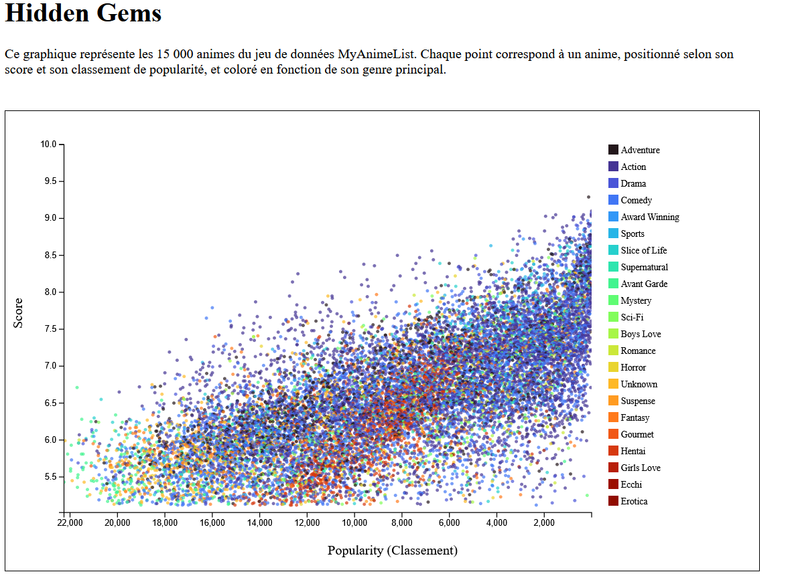
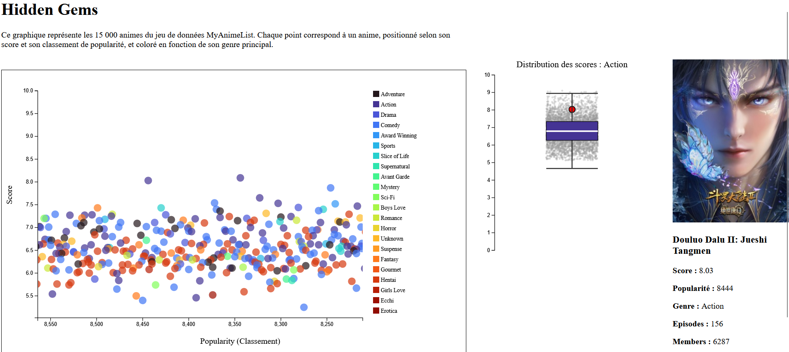

# Hidden Gems - Analyse interactive des animes MyAnimeList 

## 1. Titre du travail 
**Hidden Gems** : Une analyse interactive de la relation entre la qualité et la popularité des animes 

---

## 2. Processus d'obtention des données 

### Source des données 
Les données proviennent de **MyAnimeList (MAL)

**Source** : [Top 15,000 Ranked Anime Dataset (Update to 2024-2025) on Kaggle](https://www.kaggle.com/datasets/quanthan/top-15000-ranked-anime-dataset-update-to-32025)

### Crédits 
- Dataset créé et maintenu par la communauté MyAnimeList
- Données téléchargées depuis Kaagle

### Processus d'obtention
Le dataset Kaggle contenait déjà 15 000 animes au format CSV. 
J'ai séléctionner les 9 colonnes pertinents : `name`, `score`, `popularity`, 
`genres`, `episodes`, `members`, `scored_by`, `favorites`, `image_url`

---

## 3. Présentation des données

### Taille du dataset
- **Nombre d'animes** : 15 000
- **Nombre total de colonnes** : 24 (dans le dataset original)
- **Colonnes utilisées pour ce projet** : 9
- **Format** : CSV

### Colonnes sélectionnées et utilisées

Pour ce projet, j'ai sélectionné **9 colonnes pertinentes** parmi les 24 disponibles :

| Colonne | Type | Description |
|---------|------|-------------|
| `name` | string | Nom de l'anime |
| `score` | float | Note moyenne (0-10) |
| `popularity` | int | Classement de popularité (1 = plus populaire) |
| `genres` | string | Genres (séparés par des virgules) |
| `episodes` | int | Nombre d'épisodes |
| `members` | int | Nombre de membres ayant regardé |
| `scored_by` | int | Nombre de personnes ayant noté |
| `favorites` | int | Nombre de fois mis en favori |
| `image_url` | string | URL de l'affiche |

### Pourquoi 9 colonnes?
Les autres colonnes du dataset original (comme `type`, `soucre`, `premiered`, etc.) ne sont pas pertinents pour répondre à la question centrale du projet : *la relation entre qualité et popularité*.

### Statistiques clés
- **Score** : de 5.0 à 10.0
- **Popularité** : de 1 à 22 254
- **Genres** : plus de 40 genres différents représentés
- **Couverture temporelle** : animes de 1963 à 2025

---

## 4. Étapes de pré-traitement des données

### Nettoyage et préparation des données

- Conversion des données numériques : les colonnes numériques sont converties avec `Number()` ou l'opérateur unaire `+` afin de pouvoir effectuer les calculs statistiques et construire les échelles D3
- Gestion des genres multiples en ne conservant que le premier genre (`split(",")[0]`)
- Attribution de la valeur "Unknown" lorsqu'un anime ne possède pas de genre

### Transformation
- **Inversion du classement de popularité** : dans MyAnimeList, 1 = plus populaire, ce qui est inversé sur l'axe X pour une meilleure lisibilité
- **Extraction du premier genre** : chaque anime peut avoir plusieurs genres, on ne conserve que le premier pour simplifier la visualisation

### Points aberrants
Aucun filtrage spécifique des valeurs extrêmes n'a été appliqué. Les données sont conservées telles qu'elles apparaissent dans le dataset.

---

### Question centrale
**La popularité d'un anime reflète-t-elle sa qualité ?** 

Intuitivement, on pourrait penser que les animes les plus regardés sont aussi les meilleurs. Mais est-ce vraiment le cas ? Il existe des animes d'excellente qualité (score élevé) qui sont relativement peu populaires : les **"Hidden Gems"** , tandis que d'autres animes très populaires pourraient être surévalués.

### Le narrative
Ce projet explore cette décorrélation possible entre qualité et popularité à travers 15 000 animes :
1. **Visualiser la relation** : Un scatterplot permet d'explorer la relation entre qualité et popularité
2. **Repérer des anomalies** : Repérer visuellement des animes pouvant être considérés comme des hidden gems (bon score, peu populaire) ou, au contraire, comme très populaires malgré un score plus faible
3. **Contextualiser** : Pour chaque anime cliqué, le boxplot montre sa position parmi ses pairs du genre
4. **Explorer par genre** : Les couleurs permettent de suivre les animes d'un même genre et d'observer leurs distributions respectives

5. ### Ce que les données révèlent
- La visualisation permet d'explorer visuellement si certains animes combinent un score élevé avec une faible popularité, correspondant à l'idée de "Hidden Gems"
- L'utilisateur peut observer si certains genres semblent occuper des zones particulières du graphique
- La disposition des points permet d'explorer visuellement la relation entre popularité et qualité et d'observer si une tendance générale se dégage

### Pourquoi c'est important
Pour un fan d'anime, cette visualisation aide à :
- **Découvrir** de nouveaux excellents animes au-delà des blockbusters populaires
- **Comprendre** les biais de popularité dans la communauté
- **Justifier** des goûts différents : "C'est peut-être pas un hit, mais c'est un vrai gem"

---

## 5. Explications des visualisations

### Visualisation 1 : Scatterplot interactif (Score vs Popularité)

#### Ce qu'elle représente
Le scatterplot affiche chaque anime comme un point dans un espace bidimensionnel :
- **Axe Y (vertical)** : Score (qualité), dont le domaine est calculé automatiquement à partir du score minimum du dataset jusqu'à 10
- **Axe X (horizontal)** : Classement de popularité (de très populaire à moins populaire)
- **Couleur** : Genre principal de l'anime
- **Opacité** : 0.7 pour voir les chevauchements

#### Justifications des choix de design

**Type de graphe** : Scatterplot
- Permet de visualiser la corrélation (ou absence de corrélation) entre deux variables continues
- Idéal pour identifier les "Hidden Gems" : animes de qualité (score élevé) mais peu populaires (position à droite)

**Couleurs** : Palette Turbo via `d3.interpolateTurbo`
- Utilisation de 40+ couleurs distinctes pour différencier les genres
- Chaque genre a sa propre couleur pour un encodage clair
- La palette Turbo offre une bonne lisibilité en perception des couleurs

**Échelle** : Échelle linéaire pour les deux axes
- Simple et intuitive pour comprendre les valeurs
- Score : domaine calculé automatiquement depuis le minimum du dataset jusqu'à 10
- Popularité : domaine inversé [22 254, 1] pour avoir les plus populaires à gauche

**Interactivité**
- **Survoler** : Affiche une tooltip avec le nom, le score et la popularité
- **Brush & Zoom** : Sélectionner une zone avec la souris pour zoomer
- **Réinitialisation du zoom** : Lorsque l'utilisateur clique sans effectuer de nouvelle sélection, le graphique revient progressivement à son état initial
- **Taille adaptative** : Les cercles augmentent de taille lors du zoom (voir section suivante)
- **Clic** : Déclenche le boxplot pour voir la distribution du genre

#### Dimensionnement adaptatif des cercles
Lors du zoom, les cercles augmentent progressivement de taille pour rester visibles :
```javascript
const tailleCercle = d3.scaleSymlog().domain([22254, 0]).range([2, 15]);
```
- **Domaine** : [22254, 0] = plage entre l'absence de zoom et le zoom complet
- **Range** : [2, 15] = rayons des cercles en pixels
- **Échelle symlog** : compression logarithmique pour une augmentation progressive

#### Capture d'écran


---

### Visualisation 2 : Boxplot (Distribution des scores par genre)

#### Ce qu'elle représente
Au clic sur un anime, un boxplot apparaît montrant :
- **Distribution verticale** : tous les scores des animes du même genre
- **Point rouge** : l'anime cliqué (position dans la distribution)
- **Points gris** : tous les autres animes du genre (avec jitter)
- **Boîte** : zone contenant 50% des valeurs (intervalle interquartile Q1 à Q3)
- **Traits horizontaux** : indiquent les bornes inférieure et supérieure calculées à partir de l'écart interquartile (Q1 - 1.5×IQR et Q3 + 1.5×IQR), ainsi que la médiane

#### Justifications des choix de design

**Type de graphe** : Boxplot
- Permet de résumer la distribution statistique des scores
- Permet de contextualiser un anime parmi ses pairs du même genre

**Couleur de la boîte** : Même couleur que le genre dans le scatterplot
- Cohérence visuelle entre les deux visualisations
- Renforce l'association anime-genre

**Points individuels avec jitter** : 
- Montre la granularité réelle des données
- Jitter (décalage aléatoire) évite le chevauchement
- Opacité faible (0.3) pour ne pas surcharger

**Point rouge** : Anime sélectionné
- Très visible pour rapidement identifier sa position
- Rayon de 6px pour être bien distinct
- Bordure noire pour plus de contraste

**Infos anime** : Panneau à droite
- Affiche l'affiche, le titre, et les statistiques détaillées
- Image + texte pour une approche multi-modale
- Conversion des chiffres (pas de décimales inutiles : `+d.episodes`)

#### Capture d'écran


---

## 6. Déclaration d'utilisation d'IA génératives

### Sections assistées par IA

Les trois sections suivantes ont eu une assistance d'IA :

1. **Extraction du premier genre avec Set et spread operator**
   ```javascript
   const genres = [
     ...new Set(
       data.map((d) => {
         if (d.genres) {
           return d.genres.split(",")[0];
         }
         return "Unknown";
       }),
     ),
   ];
   ```
   - L'IA a suggéré cette approche fonctionnelle utilisant `...new Set()` pour extraire les genres uniques

2. **Générer n couleurs distinctes avec d3.quantize()**
   ```javascript
   const couleurs = d3
     .scaleOrdinal()
     .domain(genres)
     .range(d3.quantize(d3.interpolateTurbo, genres.length));
   ```
   - L'IA a suggéré `d3.quantize()` pour générer automatiquement n couleurs distinctes

3. **Extraction du genre pour chaque cercle**
   ```javascript
   .attr("fill", (d) => {
     let genre = "Unknown";
     if (d.genres) {
       genre = d.genres.split(",")[0];
     }
     return couleurs(genre);
   })
   ```
   - L'IA a aidé à structurer cette logique d'extraction du premier genre pour l'attribut de couleur

---

## Conclusion

Ce projet permet d'explorer comment une visualisation de données bien conçue peut offrir une perspective sur la relation entre qualité et popularité, et faciliter la découverte des "hidden gems" . Ces excellents animes qui méritent plus de reconnaissance.

L'interactivité (zoom, boxplot au clic) invite l'utilisateur à explorer les données selon ses intérêts et ses questions.

---

**Auteur** : Kezia Danielson 

**Cours** : Visualisation de données
